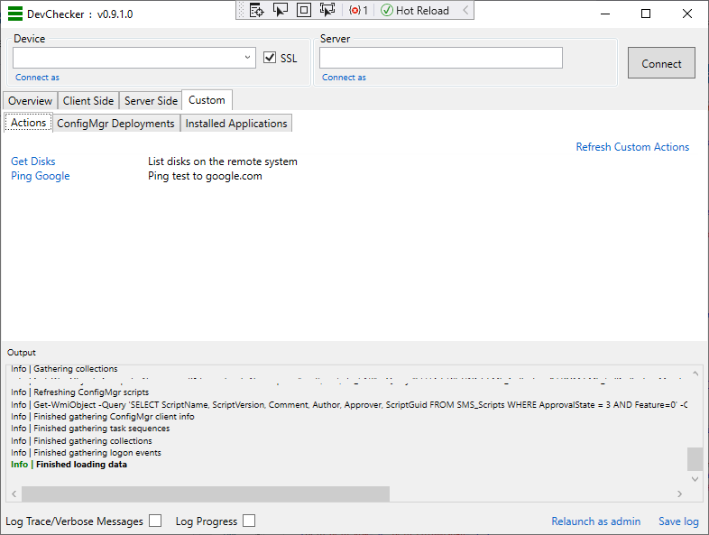

# Custom Actions


Custom actions are simply PowerShell scripts that will be run on the remote device. They are available from DevChecker\Client Side\Actions\Custom Actions

* [Adding a Custom Action](#adding-a-custom-action)
* [Output](#output)
* [Metadata](#metadata)
  




---

## Adding a Custom Action

To add a custom action, copy your custom script file to the **Scripts\Custom** folder. If DevChecker is already running, you can click *Refresh* on the Custom Actions tab.

**Note:** Be aware of the WinRM [double hop](https://docs.microsoft.com/en-us/windows/win32/winrm/multi-hop-support) problem if your script needs to access network shares. 

## Output
DevChecker will capture Write-Information, Write-Warning, Write-Error etc. from your script and output it to the *Output* pane.

If you wish to highlight your text in the Output pane, add **\*\*** to the start of your message.

## Metadata

Additional metadata can be added to your script to control how your custom action is presented in the DevChecker UI.

To add metadata, copy and paste the following somewhere in your PowerShell script. This is a comment block so will not effect the functionality of your script. 

```json
<#ActionSettings
{
    "Description": "List deployments for the connected client",
    "DisplayElement": "Tab",
    "DisplayName": "ConfigMgr Deployments",
    "FilterProperties": ["TargetName", "CollectionName"],
    "LogOutput": false,
    "LogScriptContent": false,
    "MaxRowsPerColumn": 100,
    "OutputType": "List",
    "RequiresServerConnect": true,
    "RunOnClient": false,
    "RunOnConnect": false,
}
ActionSettings#>
```

Update the fields appropriately:
* Description: The description to appear in DevChecker
* DisplayElement: How to display the output. Valid options (case sensitive): 
  * Tab: create a tab for your output. This is only suitable with the **List** OutputType
  * Modal: open a separate modal window
  * Log: log output to the DevChecker output pane
  * None: no display
* DisplayName: The name to be shown in DevChecker. If this is empty the script name will be used
* FilterProperties: When displaying in a table view, the search box will filter the view based on a match against the properties listed here
* LogOutput: Will log the output of the script, even if DisplayElement is Tab or Modal
* LogScriptContent: Set this to true to output the content of the script file to the logging pane in DevChecker
* MaxRowsPerColumn: When outputting an object, you can split the list of properties into columns. A new column will be created per *MaxRowsPerColumn* properties
* OutputType: Change the output view to suit the output of the script. Valid options (case sensitive): 
  * List: output is a list of PSObjects
  * Object: output is a single object or hashtable
  * Text: output to text format 
  * None: no output
* RequiresServerConnect: If RunOnClient is false, this will prevent the action from running if the server has been connected
* RunOnClient: Run the script on the connected client. If false, will run on the computer DevChecker is running on.
* RunOnConnect: Automatically run the script on connect to a device

The json in the comment block will be parsed when the script is read to create the appropriate configuration.
